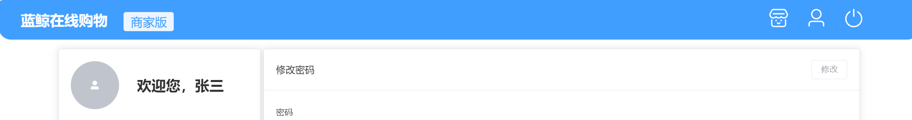
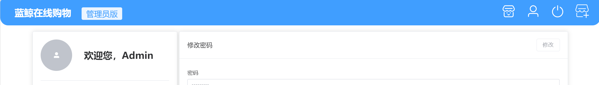
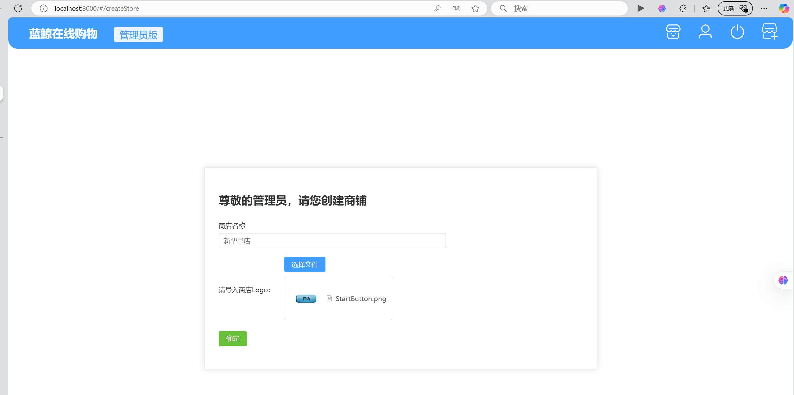
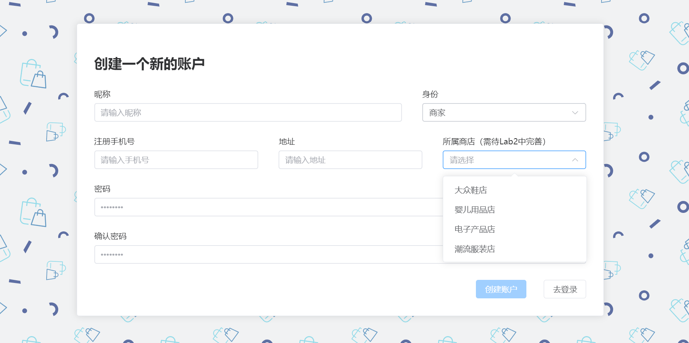
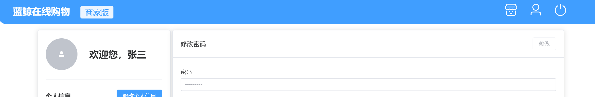
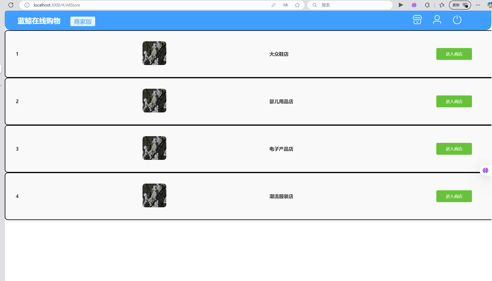
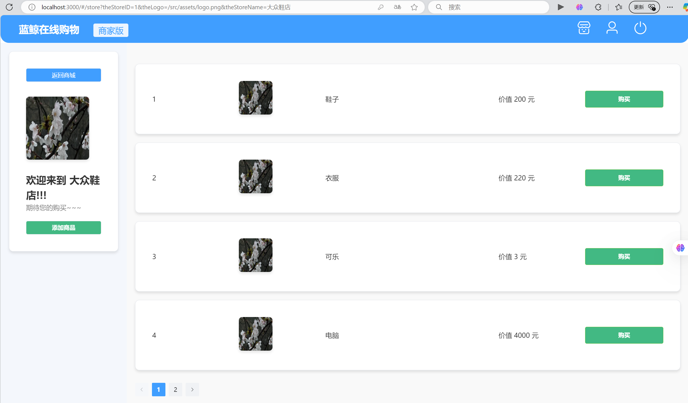
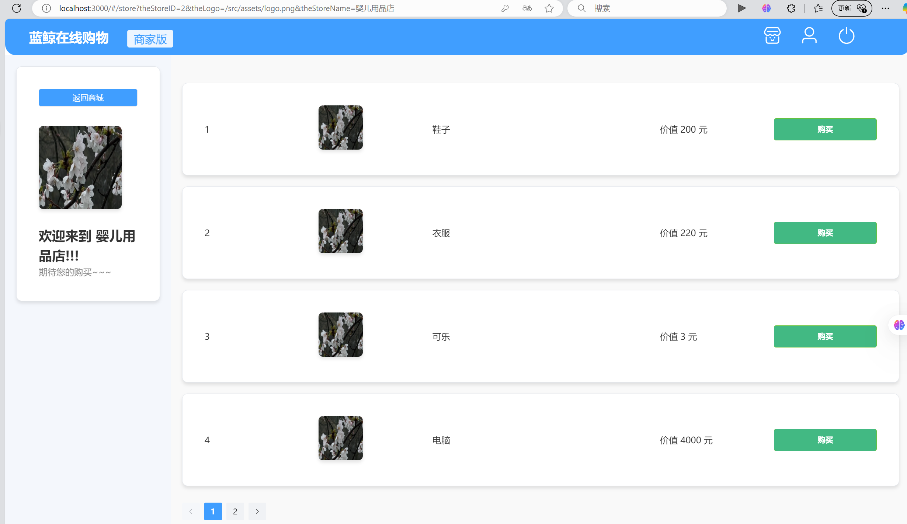
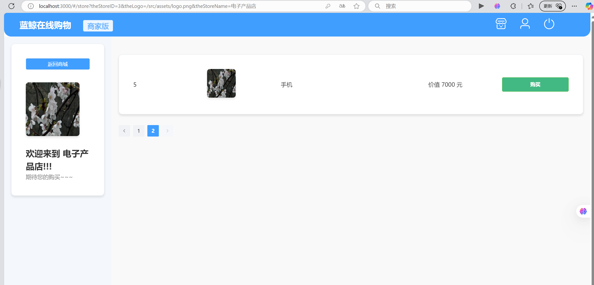
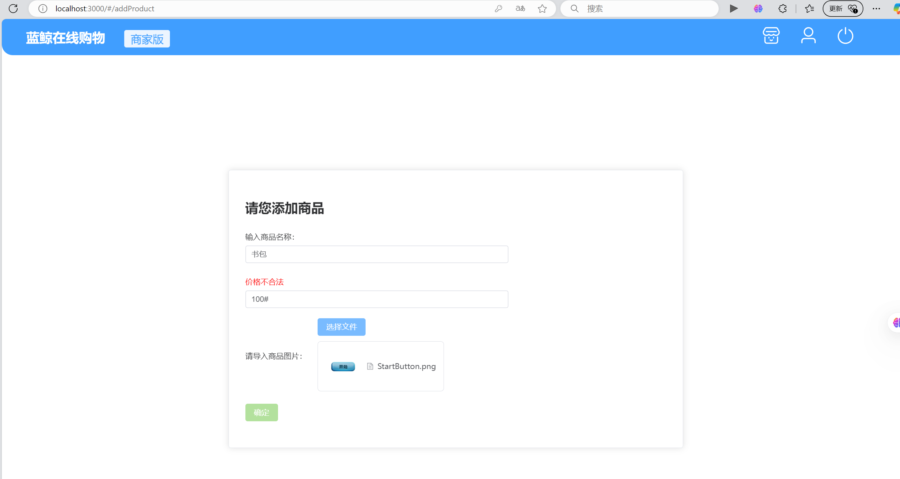

# Lab02-前端作业

## 231880038 张国良

## part 1

**1.商场管理员（Manager）可以创建商店，创建时可以上传商店Logo图片。**

```vue
//Header.vue
<script setup lang="ts">
import {router} from '../router'
import {parseRole} from "../utils"
import {User, SwitchButton} from "@element-plus/icons-vue"   //图标

const role = sessionStorage.getItem('role')    //登录的时候插入的

//退出登录
function logout() {
  ElMessageBox.confirm(
      '是否要退出登录？',
      '提示',
      {
        customClass: "customDialog",
        confirmButtonText: '是',
        cancelButtonText: '否',
        type: "warning",
        showClose: false,
        roundButton: true,
        center: true
      }
  ).then(() => {
    sessionStorage.setItem('token', '')
    router.push({path: "/login"})
  })
}
</script>


<template>
  <el-header class="custom-header" height="20">
    <el-row :gutter="10">

      <el-col :span="3" class="header-icon">
        <router-link to="/dashboard" v-slot="{navigate}" class="no-link">
          <h1 @click="navigate" class="header-text"> 蓝鲸在线购物</h1>
        </router-link>
      </el-col>

      <el-col :span="2">
        <el-tag class="role-tag" size="large">{{ parseRole(role) }}版</el-tag>
      </el-col>

      <el-col :span="15">
      </el-col>

      <el-col :span="1" class="header-icon" v-if = "true">
        <router-link to="/AllStore" v-slot="{navigate}">
          <el-icon @click="navigate" :size="35" color="white" >
            
          </el-icon>
        </router-link>
      </el-col>

      <el-col :span="1" class="header-icon">
        <router-link to="/dashboard" v-slot="{navigate}">
          <el-icon @click="navigate" :size="35" color="white" ><User /></el-icon>
        </router-link>
      </el-col>

      <el-col :span="1" class="header-icon">
        <a @click="logout">
          <el-icon :size="35" color="white" ><SwitchButton /></el-icon>
        </a>
      </el-col>

      <el-col :span="1" class="header-icon" v-if = "role === 'MANAGER'">
        <router-link to="/createStore" v-slot="{navigate}">
          <el-icon @click="navigate" :size="35" color="white" >
            
          </el-icon>
        </router-link>
      </el-col>

    </el-row>
  </el-header>
</template>


<style scoped>
......
</style>

```

在Header.vue中添加按钮链接，点击跳转到添加商铺界面，并且只有用户是管理员身份时才会渲染链接图标


```vue
//CreateStore.vue
<script setup lang="ts">
import {ref, computed} from 'vue'
import { genFileId } from 'element-plus'
import type { UploadInstance, UploadProps, UploadRawFile } from 'element-plus'
import { UploadFile } from 'element-plus'
import {router} from "../../router";

const StoreId = ref('')
const uploadedFile = ref(false)
const hasStoreIdInput = computed(() => StoreId.value.trim() !== '')

const loginDisabled = computed(() => {
  return !(hasStoreIdInput.value && uploadedFile.value)
})

const upload = ref<UploadInstance>()

const handleExceed: UploadProps['onExceed'] = (files) => {
  upload.value!.clearFiles()
  const file = files[0] as UploadRawFile
  file.uid = genFileId()
  upload.value!.handleStart(file)
}

const submitUpload = () => {
  ElMessage({
    message: "创建成功！",
    type: 'success',
    center: true,
  })
  router.go(-1);
  upload.value!.submit()
}

</script>

<template>
  <el-main class="main-frame">
    <el-card class="box-card">
      <div>
        <h1>尊敬的管理员，请您创建商铺</h1>

        <el-form>
          <el-row>
            <el-col :span="15">
              <el-form-item>
                <label for="name">商店名称</label>
                <el-input id="name" placeholder="请输入名称" v-model="StoreId"/>
              </el-form-item>
            </el-col>
          </el-row>

          <el-row>
            <el-col :span="15">
              <el-form-item>
                <label for="identity">请导入商店Logo：</label>
                <el-col :span="1"></el-col>
                <el-upload
                    ref="upload"
                    action="https://run.mocky.io/v3/9d059bf9-4660-45f2-925d-ce80ad6c4d15"
                    class="upload-demo"
                    list-type = "picture"
                    :accept="['image/*']"
                    :limit="1"
                    :on-exceed="handleExceed"
                    :auto-upload="false"
                    :on-change="(file: UploadFile, fileList: UploadFile[]) => {
                      uploadedFile = !!fileList.length
                      console.log(1)
                      console.log(file.name)
                      console.log(uploadedFile)
                    }"
                    :on-remove="(file: UploadFile, fileList: UploadFile[]) => {
                      console.log(2)
                      console.log(file)
                      console.log(fileList)
                      uploadedFile = false
                    }"
                >
                  <template #trigger>
                    <el-button type="primary">选择文件</el-button>
                  </template>
                </el-upload>
              </el-form-item>
            </el-col>
          </el-row>

          <el-row>
            <el-col :span="10">
              <el-form-item>
                <el-button class="ml-3" type="success" @click="submitUpload" :disabled="loginDisabled">
                  确定
                </el-button>
              </el-form-item>
            </el-col>
          </el-row>
        </el-form>
      </div>
    </el-card>
  </el-main>
</template>

<style scoped>
.main-frame {
  width: 100%;
  height: 100%;
  display: flex;
  align-items: center;
  justify-content: center;
}
.box-card {
  width: 50%;
  padding: 10px;
}
</style>
```

创建管理员创建商铺的界面，可以输入商店名称和选择商店Logo，商店Logo限制文件格式和数量，只能上传图片文件，并且只能上传一张，只有当商店名称和Logo全部填写才能点击确定按钮并出现创建成功信息提示。（不要求完成后端部分所以发送的文件发送服务器为"https://run.mocky.io/v3/9d059bf9-4660-45f2-925d-ce80ad6c4d15"，随便填写）

## part 2

**2.完善用户模块里的注册方法，注册商店工作人员（Staff）时可以选择所属商店。**

```vue
//Register.vue
......
            <el-col :span="1" v-if="identity==='STAFF'"></el-col>

            <el-col :span="7" v-if="identity==='STAFF'">
              <el-form-item>
                <label for="address">
                  所属商店（需待Lab2中完善）
                </label>
                <el-select id="storeName"
                           v-model="storeId"
                           placeholder="请选择"
                           style="width: 100%;"
                >
                  <el-option value="1" label="大众鞋店"/>
                  <el-option value="2" label="婴儿用品店"/>
                  <el-option value="3" label="电子产品店"/>
                  <el-option value="4" label="潮流服装店"/>
                </el-select>
              </el-form-item>
            </el-col>

          </el-row>
......
```

只要求完成前端部分，故这一部分数据写死，先暂时提供四个店铺选项，后期店铺信息从后端获取。

## Part 3

**3.所有用户都可以查看商店列表，点击列表中的商店进入商店详情界面。**

```vue
//Header.vue
<script setup lang="ts">
import {router} from '../router'
import {parseRole} from "../utils"
import {User, SwitchButton} from "@element-plus/icons-vue"   //图标

const role = sessionStorage.getItem('role')    //登录的时候插入的

//退出登录
function logout() {
  ElMessageBox.confirm(
      '是否要退出登录？',
      '提示',
      {
        customClass: "customDialog",
        confirmButtonText: '是',
        cancelButtonText: '否',
        type: "warning",
        showClose: false,
        roundButton: true,
        center: true
      }
  ).then(() => {
    sessionStorage.setItem('token', '')
    router.push({path: "/login"})
  })
}
</script>


<template>
  <el-header class="custom-header" height="20">
    <el-row :gutter="10">

      <el-col :span="3" class="header-icon">
        <router-link to="/dashboard" v-slot="{navigate}" class="no-link">
          <h1 @click="navigate" class="header-text"> 蓝鲸在线购物</h1>
        </router-link>
      </el-col>

      <el-col :span="2">
        <el-tag class="role-tag" size="large">{{ parseRole(role) }}版</el-tag>
      </el-col>

      <el-col :span="15">
      </el-col>

      <el-col :span="1" class="header-icon" v-if = "true">
        <router-link to="/AllStore" v-slot="{navigate}">
          <el-icon @click="navigate" :size="35" color="white" >
            
          </el-icon>
        </router-link>
      </el-col>

      <el-col :span="1" class="header-icon">
        <router-link to="/dashboard" v-slot="{navigate}">
          <el-icon @click="navigate" :size="35" color="white" ><User /></el-icon>
        </router-link>
      </el-col>

      <el-col :span="1" class="header-icon">
        <a @click="logout">
          <el-icon :size="35" color="white" ><SwitchButton /></el-icon>
        </a>
      </el-col>

      <el-col :span="1" class="header-icon" v-if = "role === 'MANAGER'">
        <router-link to="/createStore" v-slot="{navigate}">
          <el-icon @click="navigate" :size="35" color="white" >
            
          </el-icon>
        </router-link>
      </el-col>

    </el-row>
  </el-header>
</template>


<style scoped>
......
</style>

```

在Header.vue中添加按钮链接，点击跳转到添加商城界面，设置`v-if = true`，所有用户都会渲染。


```vue
//AllStore.vue
<script setup lang="ts">
import StoreTable from '../../components/StoreTable.vue'
import {ref} from 'vue'
import thelogo from '../../assets/logo.png';
const storelist = ref([
  {
    id: 1,
    logo: thelogo,
    storeName: "大众鞋店"
  },
  {
    id: 2,
    logo: thelogo,
    storeName: "婴儿用品店"
  },
  {
    id: 3,
    logo: thelogo,
    storeName: "电子产品店"
  },
  {
    id: 4,
    logo: thelogo,
    storeName: "潮流服装店"
  }
])

</script>

<template>
  <StoreTable
      v-for="item in storelist"
      :storeID="item.id"
      :logo="item.logo"
      :storeName="item.storeName"
  />
  <router-view />
</template>

<style scoped>

</style>
```

```vue
//StoreTable.vue
<script setup lang="ts">
import {router} from '../router'
//import {ref} from 'vue'
const props = defineProps(['storeID', 'logo', 'storeName'])

function moveToDetail(){
  // console.log(2333)
  // console.log(props.logo)
  router.push({
    path: '/store',
    query: {
      theStoreID: props.storeID,
      theLogo: props.logo,
      theStoreName: props.storeName
    }
  })
}
</script>

<template>
  <el-card class="the-card" style="width: 100%; padding: 15px; border-radius: 10px;">
    <el-row :gutter="20" justify="space-between" type="flex" align="middle">
      <el-col :span="3">
        <el-text class="store-id" size="large">
          {{ props.storeID }}
        </el-text>
      </el-col>
      <el-col :span="3">
        <el-image class="store-logo" style="width: 80px; height: 80px" :src="props.logo" :fit="'fill'" />
      </el-col>
      <el-col :span="5">
        <el-text class="store-name" size="large">
          {{ props.storeName }}
        </el-text>
      </el-col>
      <el-col :span="3">
        <el-button @click="moveToDetail" class="store-btn" type="success" style="width: 120px; height: 40px">
          进入商店
        </el-button>
      </el-col>
    </el-row>
  </el-card>
</template>

<style scoped>
.the-card {
  border: 2px solid black;
  box-shadow: 0 4px 8px rgba(0, 0, 0, 0.1);
  background-color: #f9f9f9;
  transition: transform 0.3s, box-shadow 0.3s;
}

.the-card:hover {
  transform: translateY(-5px);
  box-shadow: 0 8px 16px rgba(0, 0, 0, 0.2);
}

.store-id, .store-name {
  font-weight: bold;
  color: #333;
}

.store-logo {
  border-radius: 10px;
}

.store-btn {
  font-size: 14px;
  padding: 0;
  text-align: center;
}

</style>

```

创建商城界面（AllStore.vue），商城界面由相同的组件商铺表（StoreTable.vue）组成，商城界面的数据是前端写死的数据，后期从后端获取，信息由父传子将对应信息传递给StoreTable，并形成商铺表。

## part 4 & part 5

**4.商店工作人员可以在自己所属商店的详情界面创建商品。**

**5.所有用户都可以在商店详情界面查看该商店下的商品列表。**

在StoreTable界面创建按钮，用于进入商店界面，同时进入商店详情界面时候携带了商店的相关信息（storeID，logo，storeName）

```vue
//StoreDetail.vue
<script setup lang="ts">
import { useRoute } from 'vue-router'
import {router} from '../../router'
import thelogo from "../../assets/logo.png";
import {ref, computed} from 'vue'
import ProductTable from "../../components/ProductTable.vue";
const currentPage = ref(1)

const currentPageProducts = computed(() => {
  const start = (currentPage.value - 1) * 4
  const end = currentPage.value * 4
  return productList.value.slice(start, end)
})

const handlePageChange = (page: number) => {
  currentPage.value = page
}

const goBack = () => {
  router.go(-1);
};

function addProduct(){
  console.log(1)
  router.push({ path: '/addProduct' })
}

const productList = ref([
  {
    id: 1,
    logo: thelogo,
    productName: "鞋子",
    cost: 200
  },
  {
    id: 2,
    logo: thelogo,
    productName: "衣服",
    cost: 220
  },
  {
    id: 3,
    logo: thelogo,
    productName: "可乐",
    cost: 3
  },
  {
    id: 4,
    logo: thelogo,
    productName: "电脑",
    cost: 4000
  },{
    id: 5,
    logo: thelogo,
    productName: "手机",
    cost: 7000
  }
])
const route = useRoute()
const storeName = route.query.theStoreName
const storeID = route.query.theStoreID
const storeLogo = route.query.theLogo
const role = sessionStorage.getItem("role")
const theID = sessionStorage.getItem("store_id")
</script>

<template>
  <el-container style="height: 100vh;">
    <el-aside width="300px" style="background-color: #f4f7fc; padding: 20px; overflow-y: auto;">
      <el-card class="store-info-card" style="padding: 20px;">
        <el-button @click="goBack" v-if="true" class="back-btn" >返回商城</el-button>
        <el-image class="store-logo" style="width: 150px; height: 150px" :src="storeLogo" :fit="'fill'" />
        <br><br>
        <el-text size="large" class="store-welcome">欢迎来到 {{ storeName }}!!!<br></el-text>
        <el-text size="small" class="store-slogan">期待您的购买~~~</el-text>
        <el-button @click="addProduct" v-if="role === 'STAFF' && theID === storeID" class="add-product-btn">添加商品</el-button>
      </el-card>
    </el-aside>

    <el-main style="padding: 20px; overflow-y: auto;">
      <el-row :gutter="20">
        <el-col v-for="item in currentPageProducts" :key="item.id" :span="24" class="product-col">
          <ProductTable
              :productID="item.id"
              :logo="item.logo"
              :productName="item.productName"
              :cost="item.cost"
          />
        </el-col>
      </el-row>
      <el-pagination
          background
          layout="prev, pager, next"
          :total="productList.length"
          :page-size="4"
          :current-page="currentPage"
          @current-change="handlePageChange"
          style="margin-top: 20px; text-align: center;"
      />
    </el-main>
  </el-container>
</template>

<style scoped>
.store-info-card {
  padding: 20px;
  background-color: #fff;
  border-radius: 10px;
  box-shadow: 0 4px 6px rgba(0, 0, 0, 0.1);
}

.store-welcome {
  font-size: 24px;
  font-weight: bold;
  color: #333;
}

.store-slogan {
  font-size: 16px;
  color: #888;
}

.store-logo {
  margin-top: 15px;
  border-radius: 8px;
  box-shadow: 0 4px 6px rgba(0, 0, 0, 0.1);
}

.add-product-btn {
  margin-top: 20px;
  width: 100%;
  background-color: #42b983;
  color: #fff;
  font-weight: bold;
}

.back-btn {
  background-color: #409eff;
  color: #fff;
  width: 100%;
  margin-bottom: 20px;
}

.product-col {
  padding: 10px;
}

.el-row {
  margin-top: 20px;
}

.el-main {
  background-color: #f9f9f9;
  padding: 20px;
  overflow-y: auto;
}
</style>
```

```vue
//ProductTable.vue
<script setup lang="ts">
const props = defineProps(['productID', 'logo', 'productName', 'cost'])
</script>

<template>
  <el-card class="the-card">
    <el-row :gutter="20" justify="space-between" align="middle">
      <el-col :span="4">
        <el-text class="product-id" size="large">{{ props.productID }}</el-text>
      </el-col>
      <el-col :span="4">
        <el-image class="product-logo" :src="props.logo" :fit="'fill'" />
      </el-col>
      <el-col :span="8">
        <el-text class="product-name" size="large">{{ props.productName }}</el-text>
      </el-col>
      <el-col :span="4">
        <el-text class="product-cost" size="large">价值 {{ props.cost }} 元</el-text>
      </el-col>
      <el-col :span="4">
        <el-button class="product-btn" type="success" style="width: 100%; height: 40px;">
          购买
        </el-button>
      </el-col>
    </el-row>
  </el-card>
</template>

<style scoped>
.the-card {
  padding: 20px;
  background-color: #fff;
  border-radius: 10px;
  box-shadow: 0 4px 6px rgba(0, 0, 0, 0.1);
}

.product-id,
.product-name,
.product-cost {
  font-size: 16px;
  color: #333;
}

.product-logo {
  width: 80px;
  height: 80px;
  border-radius: 8px;
  box-shadow: 0 4px 6px rgba(0, 0, 0, 0.1);
}

.product-btn {
  background-color: #42b983;
  color: #fff;
  font-weight: bold;
}

.el-button {
  width: 100%;
}
</style>

```

进入商店详情界面，productList是在这里写死的，后期从后端获取，商店详情界面由两部分构成，第一部分是侧边栏部分，记录商店相关信息以及两个按钮（返回商城和添加商品），从本地获取在登陆时加载的数据（用户的storeId），添加商品按钮只有在核验用户的storeId和本商店的ID一样时才会渲染，然后main部分是商店的商品信息，是由组件ProductTable构成，也是由父传子传递信息给ProductTable，商品列表所有用户均可查看，并且一页显示四个商品，可以换页



```vue
//CreateProduct.vue
<script setup lang="ts">
import {ref, computed} from 'vue'
import { genFileId } from 'element-plus'
import type { UploadInstance, UploadProps, UploadRawFile } from 'element-plus'
import { UploadFile } from 'element-plus'
import {router} from '../../router'

const productName = ref('')
const productCost = ref('')
const uploadedFile = ref(false)
const hasProductNameInput = computed(() => productName.value.trim() !== '')
const costLegal = computed(() => {
  const regex = /^[0-9]+(\.[0-9]+)?$/
  const cost = parseFloat(productCost.value)
  return !isNaN(cost) && cost >= 0 && regex.test(productCost.value)
})
const hasCostInput = computed(() => {return productCost.value != ''})
const loginDisabled = computed(() => {
  return !(hasCostInput.value && costLegal.value && hasProductNameInput.value && uploadedFile.value)
})

const upload = ref<UploadInstance>()

const handleExceed: UploadProps['onExceed'] = (files) => {
  upload.value!.clearFiles()
  const file = files[0] as UploadRawFile
  file.uid = genFileId()
  upload.value!.handleStart(file)
}

const submitUpload = () => {
  ElMessage({
    message: "添加成功！",
    type: 'success',
    center: true,
  })
  router.go(-1);
  upload.value!.submit()
}

</script>

<template>
  <el-main class="main-frame">
    <el-card class="box-card">
      <div>
        <h1>请您添加商品</h1>
        <el-form>
          <el-row>
            <el-col :span="15">
              <el-form-item>
                <label for="name">输入商品名称：</label>
                <el-input id="name" placeholder="请输入名称" v-model="productName"/>
              </el-form-item>
            </el-col>
          </el-row>

          <el-row>
            <el-col :span="15">
              <el-form-item>
                <label v-if="!hasCostInput" for="tel">输入商品价格：</label>
                <label v-else-if="!costLegal" for="tel" class="error-warn">价格不合法</label>
                <label v-else for="tel">输入商品价格：</label>
                <el-input id="tel" type="text" v-model="productCost"
                          required :class="{'error-warn-input' :(hasCostInput && !costLegal)}"
                          placeholder="请输入商品价格"/>
              </el-form-item>
            </el-col>
          </el-row>

          <el-row>
            <el-col :span="15">
              <el-form-item>
                <label for="identity">请导入商品图片：</label>
                <el-col :span="1"></el-col>
                <el-upload
                    ref="upload"
                    action="https://run.mocky.io/v3/9d059bf9-4660-45f2-925d-ce80ad6c4d15"
                    class="upload-demo"
                    list-type = "picture"
                    :accept="['image/*']"
                    :limit="1"
                    :on-exceed="handleExceed"
                    :auto-upload="false"
                    :on-change="(file: UploadFile, fileList: UploadFile[]) => {
                      uploadedFile = !!fileList.length
                      console.log(1)
                      console.log(file.name)
                      console.log(uploadedFile)
                    }"
                    :on-remove="(file: UploadFile, fileList: UploadFile[]) => {
                      console.log(2)
                      console.log(file)
                      console.log(fileList)
                      uploadedFile = false
                    }"
                >
                  <template #trigger>
                    <el-button type="primary">选择文件</el-button>
                  </template>
                </el-upload>
              </el-form-item>
            </el-col>
          </el-row>

          <el-row>
            <el-col :span="10">
              <el-form-item>
                <el-button class="ml-3" type="success" @click="submitUpload" :disabled="loginDisabled">
                  确定
                </el-button>
              </el-form-item>
            </el-col>
          </el-row>
        </el-form>
      </div>
    </el-card>
  </el-main>
</template>

<style scoped>
.main-frame {
  width: 100%;
  height: 100%;
  display: flex;
  align-items: center;
  justify-content: center;
}
.box-card {
  width: 50%;
  padding: 10px;
}
.error-warn-input{
  --el-input-focus-border-color: red;
}
.error-warn{
  color: red;
}
</style>
```

点击添加商品按钮后进入此界面，同创建商铺界面类似，输入商品的名称，价格，Logo，价格要求合法，Logo只能上传图片且只能上传一张，只有全部填写并且合法时候才可以点击确定并发出“添加成功”的信息



其他代码：（index.tx部分）

```typescript
//index.tx
import {createRouter, createWebHashHistory} from "vue-router"

const router = createRouter({
    history: createWebHashHistory(),
    routes: [{
        path: '/',
        redirect: '/login',
    }, {
        path: '/login',
        component: () => import('../views/user/Login.vue'),
        meta: {title: '用户登录'}
    }, {
        path: '/register',
        component: () => import('../views/user/Register.vue'),
        meta: {title: '用户注册'}
    }, {
        path: '/home',
        redirect: '/dashboard',
        component: () => import('../views/Home.vue'),
        children: [
            {
                path: '/dashboard',
                name: 'Dashboard',
                component: () => import('../views/user/Dashboard.vue'),
                meta: {title: '个人信息'}
            }, {
                path: '/createStore',
                name: 'CreateStore',
                component: () => import('../views/store/CreateStore.vue'),
                meta: {title: '添加店铺'}
            },{
                path: '/AllStore',
                name: 'AllStore',
                component: () => import('../views/store/AllStore.vue'),
                meta: {title: '商城'}
            },{
                path: '/addProduct',
                name: 'addProduct',
                component: () => import('../views/product/CreateProduct.vue'),
                meta: {title: '添加商品'}
            },{
                path: '/store',
                name: 'store',
                component: () => import('../views/store/StoreDetail.vue'),
                meta: {title: '商店'}
            }
        ]
    }, {
        path: '/404',
        name: '404',
        component: () => import('../views/NotFound.vue'),
        meta: {title: '404'}
    }, {
        path: '/:catchAll(.*)',
        redirect: '/404'
    }]
})

router.beforeEach((to, _, next) => {
    const token: string | null = sessionStorage.getItem('token');
    const role: string | null = sessionStorage.getItem('role')

    if (to.meta.title) {
        document.title = to.meta.title
    }

    if (token) {
        if (to.meta.permission) {
            if (to.meta.permission.includes(role!)) {
                next()
            } else {
                next('/404')
            }
        } else {
            next()
        }
    } else {
        if (to.path === '/login') {
            next();
        } else if (to.path === '/register') {
            next()
        } else {
            next('/login')
        }
    }
})

export {router}

```

表示路径跳转的代码

