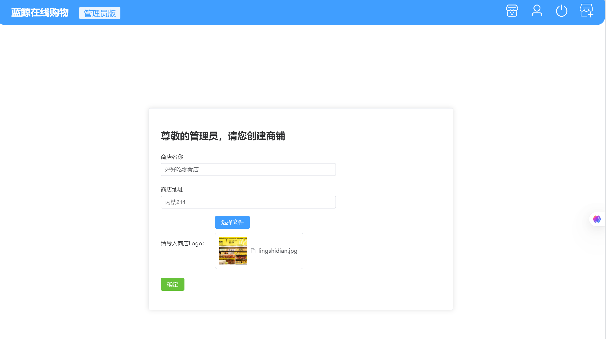
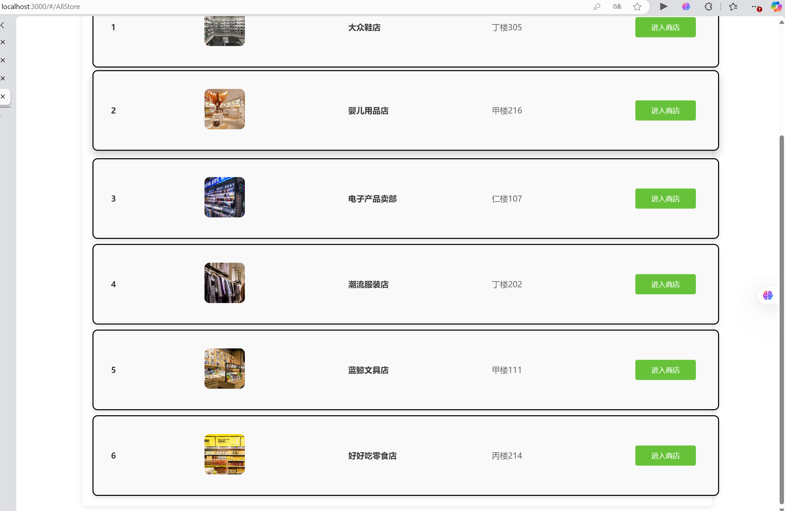
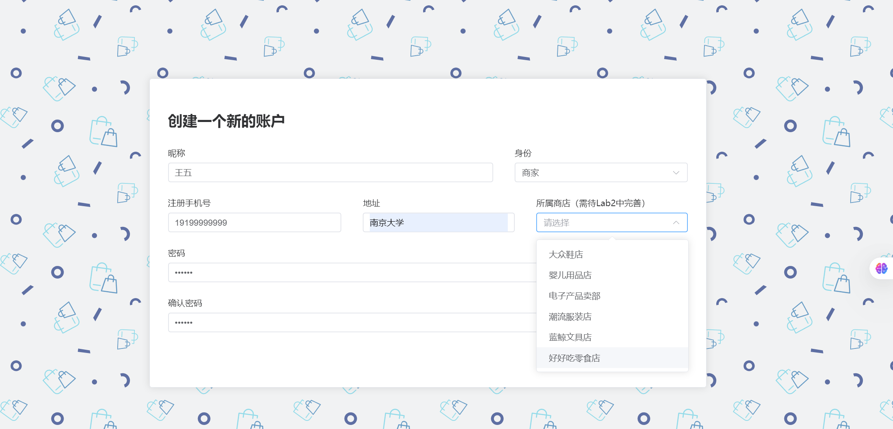
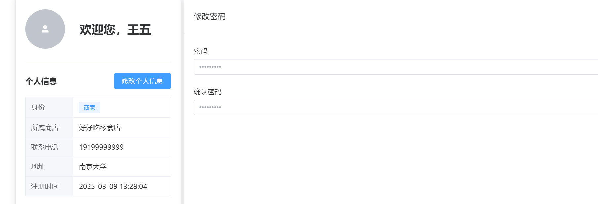
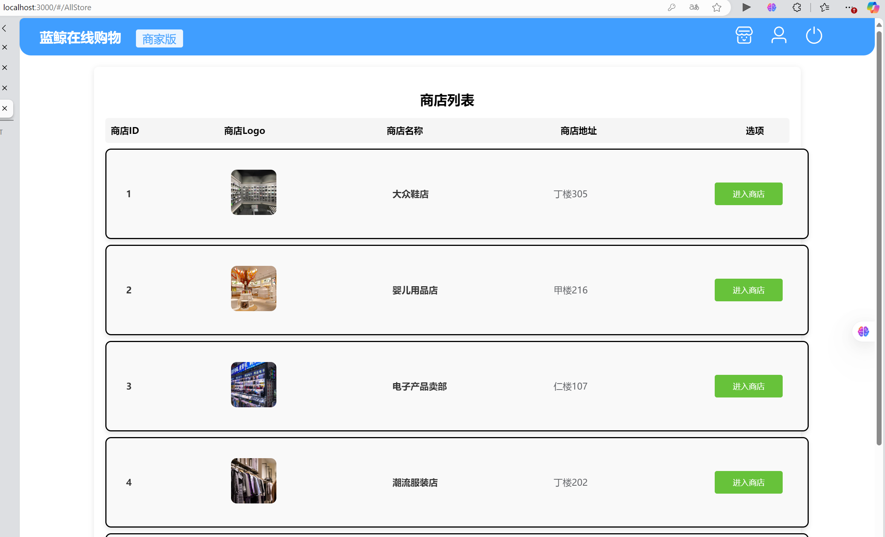
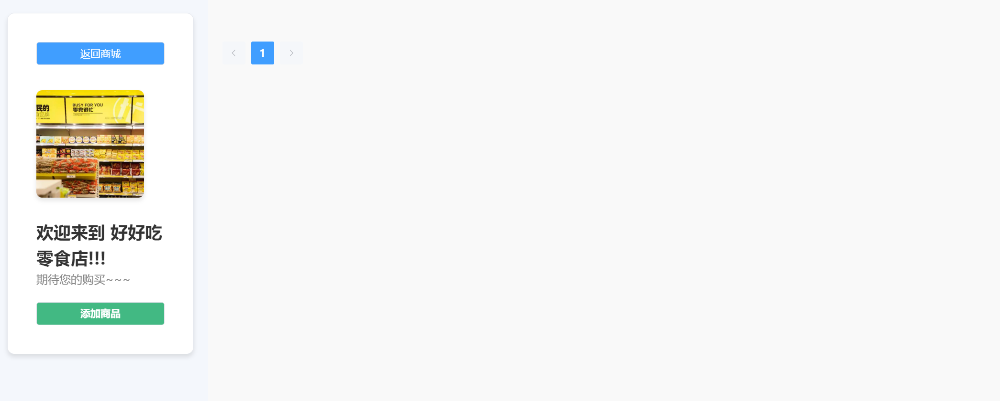
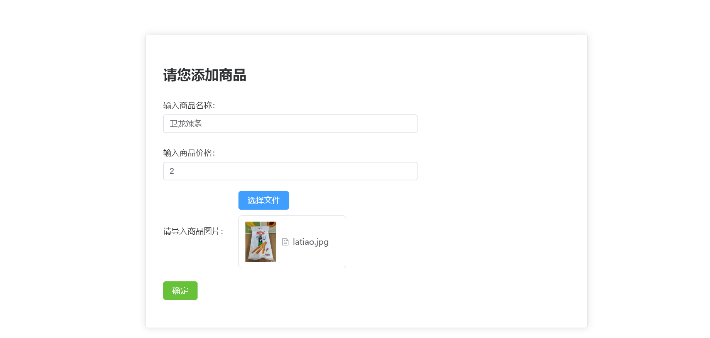
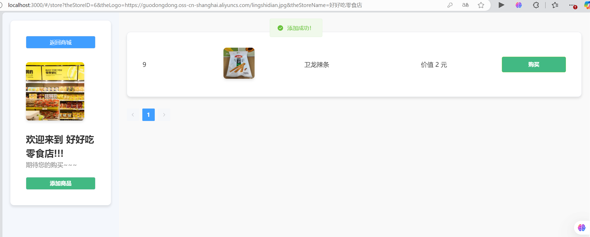
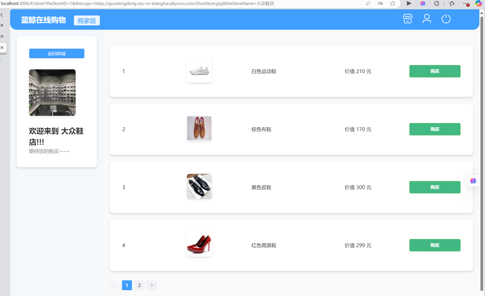

# Lab04-数据库

## 23188003 张国良

## Part 1

**1.商场管理员（Manager）可以创建商店，创建时可以上传商店Logo图片**

### (1)实现图片上传

修改`_prefix.tx`并创建`tools.tx`文件：

```typescript
//_prefix.tx
//总api
export const API_MODULE = '/api'

//用户模块
export const USER_MODULE = `${API_MODULE}/users`
export const STORE_MODULE = `${API_MODULE}/stores`
export const TOOLS_MODULE = `${API_MODULE}/tools`
export const PRODUCT_MODULE = `${API_MODULE}/product`
```

```typescript
//tools.tx
import {axios} from '../utils/request'
import {TOOLS_MODULE} from './_prefix'

export const uploadImage = (file: File) => {
    const formData = new FormData();
    formData.append('file', file);
    return axios.post(`${TOOLS_MODULE}/images`, formData, {
        headers: {}
    }).then(res => {
        return res;
    });
}
```

这是前端部分实现与后端的联系，接下来是后端部分api的实现：

对于Controller层：

```java
//ToolsController.java
package com.seecoder.BlueWhale.controller;
import com.seecoder.BlueWhale.service.ImageService;
import com.seecoder.BlueWhale.vo.ResultVO;
import org.springframework.beans.factory.annotation.Autowired;
import org.springframework.web.bind.annotation.PostMapping;
import org.springframework.web.bind.annotation.RequestMapping;
import org.springframework.web.bind.annotation.RequestParam;
import org.springframework.web.bind.annotation.RestController;
import org.springframework.web.multipart.MultipartFile;

@RestController
@RequestMapping("/api/tools")
public class ToolsController {

    @Autowired
    ImageService imageService;

    @PostMapping("/images")
    public ResultVO<String> upload(@RequestParam("file") MultipartFile file){
        return ResultVO.buildSuccess(imageService.upload(file));
    }
}
```

里面实现与Service层的联系：

```java
//ImageService.java
package com.seecoder.BlueWhale.service;
import org.springframework.web.multipart.MultipartFile;
public interface ImageService {
    String upload(MultipartFile file);
}
```

对于接口的实现：

```java
//ImageServiceImpl.java
package com.seecoder.BlueWhale.serviceImpl;
import com.seecoder.BlueWhale.service.ImageService;
import org.springframework.beans.factory.annotation.Autowired;
import org.springframework.stereotype.Service;
import org.springframework.web.multipart.MultipartFile;
import com.seecoder.BlueWhale.util.OssUtil;
import com.seecoder.BlueWhale.exception.BlueWhaleException;

@Service
public class ImageServiceImpl implements ImageService {

    @Autowired
    OssUtil ossUtil;

    @Override
    public String upload(MultipartFile file) {
        try {
            return ossUtil.upload(file.getOriginalFilename(),file.getInputStream());
        }catch (Exception e){
            e.printStackTrace();
            throw BlueWhaleException.fileUploadFail();
        }
    }
}
```

通过`OssUtil`具体实现：

```java
//OssUtil.java
package com.seecoder.BlueWhale.util;
import com.aliyun.oss.OSS;
import com.aliyun.oss.OSSClientBuilder;
import com.aliyun.oss.model.PutObjectRequest;
import lombok.Getter;
import lombok.NoArgsConstructor;
import lombok.Setter;
import org.springframework.boot.context.properties.ConfigurationProperties;
import org.springframework.stereotype.Component;
import java.io.InputStream;
import java.util.Date;

@Component
@Getter
@Setter
@NoArgsConstructor
@ConfigurationProperties("aliyun.oss")
public class OssUtil {
    private String endpoint;
    private String accessKeyId;
    private String accessKeySecret;
    private String bucketName;

    public String upload(String objectName, InputStream inputStream) {
        OSS ossClient = new OSSClientBuilder().build(endpoint, accessKeyId, accessKeySecret);
        PutObjectRequest putObjectRequest = new PutObjectRequest(bucketName, objectName, inputStream);
        try {
            ossClient.putObject(putObjectRequest);
        }finally {
            if (ossClient != null) {
                ossClient.shutdown();
            }
        }
        return ossClient.generatePresignedUrl(bucketName, objectName, new Date()).toString().split("\\?Expires")[0];
    }
}
```

到这一步实现了图片的上传以及图片URL的返回

### (2)实现商店的上传和数据库保存

**前端的一些代码**

```typescript
//store.tx
import {axios} from '../utils/request'
import {STORE_MODULE} from './_prefix'

type AddInfo = {
    name: string,
    logo: string,
    address: string
}
export const getHelloWord = () => {
    return axios.get(`${STORE_MODULE}/getWord`)
        .then(res => {
            return res
        })
}
//（getHelloWord）并不重要的方法，用于课堂最简单作业的完成
export const createStore = (addInfo: AddInfo) => {
    return axios.post(`${STORE_MODULE}/addStore`, addInfo,
        {headers: {'Content-Type': 'application/json'}})
        .then(res => {
            return res
        })
}
export const getAllStore = () => {
    return axios.get(`${STORE_MODULE}/all`)
        .then(res => {
            return res
        })
}
export const getStoreInfo = (storeId: number) => {
    return axios.get(`${STORE_MODULE}/info`, {
        params: { storeId }
    })
        .then(res => res);
}
```

**后端api的具体实现**

对于Controller层：

```java
//StoreController.java
package com.seecoder.BlueWhale.controller;
import com.seecoder.BlueWhale.service.StoreService;
import com.seecoder.BlueWhale.vo.ResultVO;
import com.seecoder.BlueWhale.vo.StoreVO;
import org.springframework.beans.factory.annotation.Autowired;
import org.springframework.web.bind.annotation.*;

import java.util.List;

@RestController
@RequestMapping("/api/stores")
public class StoreController {

    @Autowired
    StoreService storeService;

    @GetMapping("getWord")
    public String getWord(){
        return "hello word";
    }

    @PostMapping("addStore")
    public ResultVO<Boolean> addStore(@RequestBody StoreVO storeVO){
        return ResultVO.buildSuccess(storeService.addStore(storeVO));
    }

    @GetMapping("all")
    public ResultVO<List<StoreVO>> getAllStore(){
        return ResultVO.buildSuccess(storeService.getAllStore());
    }

    @GetMapping("info")
    public ResultVO<StoreVO> getStoreInfo(@RequestParam Integer storeId) {
        return ResultVO.buildSuccess(storeService.getInformation(storeId));
    }
}
```

对于Service层：

```java
//StoreService.java
package com.seecoder.BlueWhale.service;

import com.seecoder.BlueWhale.vo.StoreVO;

import java.util.List;

public interface StoreService {
    Boolean addStore(StoreVO storeVO);

    StoreVO getInformation(Integer storeId);

    List<StoreVO> getAllStore();
}

```

```java
//StoreServiceImpl.java
package com.seecoder.BlueWhale.serviceImpl;

import com.seecoder.BlueWhale.exception.BlueWhaleException;
import com.seecoder.BlueWhale.po.Store;
import com.seecoder.BlueWhale.repository.StoreRepository;
import com.seecoder.BlueWhale.service.StoreService;
import com.seecoder.BlueWhale.vo.StoreVO;
import org.springframework.beans.factory.annotation.Autowired;
import org.springframework.stereotype.Service;

import java.util.Date;
import java.util.List;
import java.util.stream.Collectors;

@Service
public class StoreServiceImpl implements StoreService{

    @Autowired
    StoreRepository storeRepository;

    @Override
    public Boolean addStore(StoreVO storeVO){
        Store store = storeRepository.findByName(storeVO.getName());
        if(store != null){
            throw BlueWhaleException.storeAlreadyExists();
        }
        Store newStore = storeVO.toPO();
        newStore.setCreateTime(new Date());
        storeRepository.save(newStore);
        return true;
    }

    @Override
    public StoreVO getInformation(Integer storeId){
        return storeRepository.findById(storeId).get().toVO();
    }

    @Override
    public List<StoreVO> getAllStore(){
        return storeRepository.findAll().stream().map(Store::toVO).collect(Collectors.toList());
    }
}
```

实现了三个方法，`addStore`实现了添加商店的逻辑，确保没有重名商店，`getInformation`方法返回对应ID的商店的信息，`getAllStore`方法返回所有商店的信息并以列表形式返回

VO和PO：

```java
//StoreVO.java
package com.seecoder.BlueWhale.vo;

import com.seecoder.BlueWhale.po.Store;
import lombok.Getter;
import lombok.NoArgsConstructor;
import lombok.Setter;

import java.util.Date;

@Getter
@Setter
@NoArgsConstructor
public class StoreVO {

    private Integer id;

    private String name;

    private String logo;

    private Date createTime;

    private String address;

    public Store toPO(){
        Store store=new Store();
        store.setId(this.id);
        store.setName(this.name);
        store.setLogo(this.logo);
        store.setCreateTime(this.createTime);
        store.setAddress(this.address);
        return store;
    }
}

```

```java
//Store.java
package com.seecoder.BlueWhale.po;

import com.seecoder.BlueWhale.vo.StoreVO;
import lombok.Getter;
import lombok.NoArgsConstructor;
import lombok.Setter;

import javax.persistence.*;
import java.util.Date;

@Getter
@Setter
@NoArgsConstructor
@Entity
public class Store {

    @GeneratedValue(strategy = GenerationType.IDENTITY)
    @Id
    @Column(name = "id")
    private Integer id;

    @Basic
    @Column(name = "name")
    private String name;

    @Basic
    @Column(name = "create_time")
    private Date createTime;

    @Basic
    @Column(name = "logo")
    private String logo;

    @Basic
    @Column(name = "address")
    private String address;


    public StoreVO toVO(){
        StoreVO storeVO=new StoreVO();
        storeVO.setId(this.id);
        storeVO.setName(this.name);
        storeVO.setLogo(this.logo);
        storeVO.setCreateTime(this.createTime);
        storeVO.setAddress(this.address);
        return storeVO;
    }
}
```

通过Repository层与数据库交互：

```java
//StoreRepository.java
package com.seecoder.BlueWhale.repository;

import com.seecoder.BlueWhale.po.Store;
import org.springframework.data.jpa.repository.JpaRepository;

public interface StoreRepository extends JpaRepository<Store, Integer>{
    Store findByName(String name);
    //Store findById(Integer storeId);
}
```

### (3)最终前端效果的实现

```vue
//CreateStore.vue
<script setup lang="ts">
......
//提交按钮的点击逻辑：
const submitUpload = () => {
  if(!theFile.value) return;
  const file = theFile.value.raw as File;
  console.log(file.name)
  uploadImage(file).then((res) => {
    imageUrl.value = res.data.result
    console.log(res.data.result)
    createStore({
      name: StoreId.value,
      logo: imageUrl.value,
      address: storeAddress.value
    }).then(res => {
      console.log(res.data.result)
      ElMessage({
      message: "创建成功！",
      type: "success",
      center: true,
    })
      router.go(-1);})
  })
}
......
//文件的选中和保存（theFile值的决定）

                <el-upload
                    ref="upload"
                    action=""
                    class="upload-demo"
                    list-type = "picture"
                    :accept="['image/*']"
                    :limit="1"
                    :on-exceed="handleExceed"
                    :auto-upload="false"
                    :on-change="(file: UploadFile, fileList: UploadFile[]) => {
                      uploadedFile = !!fileList.length
                      theFile = file
                      console.log(1)
                      console.log(file.name)
                      console.log(uploadedFile)
                    }"
                    :on-remove="(file: UploadFile, fileList: UploadFile[]) => {
                      console.log(2)
                      console.log(file)
                      console.log(fileList)
                      theFile = null
                      uploadedFile = false
                    }"
                >
                  <template #trigger>
                    <el-button type="primary">选择文件</el-button>
                  </template>
                </el-upload>
......
```

最终把创建的商店上传数据库保存了商店logoURL的位置并返回上一层

最终效果：


## Part 2

**2.完善用户模块里的注册方法，注册商店工作人员（Staff）时可以选择所属商店**

在Part 1中代码同步实现，实现了`getAllStore`的后端api，前端调取可以获取从数据库中读得的所有数据库信息

修改Register.vue：

```vue
//Register.vue
<script setup lang="ts">
//......
const storeOptions = ref<{ id: number, name: string }[]>([])
//......
getAllStore().then(res => {
  storeOptions.value = res.data.result
})
//......
</script>

//......
<el-col :span="7" v-if="identity==='STAFF'">
              <el-form-item>
                <label for="address">
                  所属商店（需待Lab2中完善）
                </label>
                <el-select id="storeName"
                           v-model="storeId"
                           placeholder="请选择"
                           style="width: 100%;"
                >
                  <el-option v-for="store in storeOptions" :key="store.id" :value="store.id" :label="store.name"/>
                </el-select>
              </el-form-item>
            </el-col>
//......

```

从`storeOptions`中读取数据库中获得的信息渲染在选项中

最终效果：


## Part 3

**3.所有用户都可以查看商店列表，点击列表中的商店进入商店详情界面。**

同Part 2的实现，先用`getAllStore`获取所有商店信息再传递给AllStore.vue

```vue
//AllStore.vue
<script setup lang="ts">
import StoreTable from '../../components/StoreTable.vue'
import {ref} from 'vue'
import {getAllStore} from "../../api/store.ts"

const theStores = ref<{ id: number, name: string, logo: string, address: string }[]>([])
getAllStore().then(res => {
  theStores.value = res.data.result
})

</script>
<template>
  <div class="store-container">
    <h2 class="store-header">商店列表</h2>
    <div class="store-table-header">
      <span>商店ID</span>
      <span>商店Logo</span>
      <span>商店名称</span>
      <span>商店地址</span>
      <span>选项</span>
    </div>
    <div class="store-list">
      <StoreTable
          v-for="item in theStores"
          :key="item.id"
          :storeID="item.id"
          :logo="item.logo"
          :address="item.address"
          :storeName="item.name"
      />
    </div>
  </div>
  <router-view />
</template>
//.......
```
最终效果：

## Part 4

**4.商店工作人员可以在自己所属商店的详情界面创建商品**

这一部分实现了所有的商品有关的前端和后端代码：
**前端相关代码：**

```typescript
//Product.tx
import {axios} from '../utils/request'
import {PRODUCT_MODULE} from './_prefix'
type ProductInfo = {
    name: string,
    logo: string,
    storeId: number,
    cost: number
}
export const createProduct = (productInfo: ProductInfo) => {
    return axios.post(`${PRODUCT_MODULE}/addProduct`, productInfo,
        {headers: {'Content-Type': 'application/json'}})
        .then(res => {
            return res
        })
}
export const getAllProduct = (storeId: number) => {
    return axios.get(`${PRODUCT_MODULE}/all`, {
        params: { storeId }
    })
        .then(res => res);
}
```

这里要求调用后端实现`createProduct`和通过商店ID查找`getAllProduct`的功能

**后端相关代码：**

Controller层的代码：

```java
//ProductController.java
package com.seecoder.BlueWhale.controller;
import com.seecoder.BlueWhale.service.ProductService;
import com.seecoder.BlueWhale.vo.ProductVO;
import com.seecoder.BlueWhale.vo.ResultVO;
import org.springframework.beans.factory.annotation.Autowired;
import org.springframework.web.bind.annotation.*;

import java.util.List;

@RestController
@RequestMapping("/api/product")
public class ProductController {

    @Autowired
    ProductService productService;

    @PostMapping("addProduct")
    public ResultVO<Boolean> addProduct(@RequestBody ProductVO productVO){
        return ResultVO.buildSuccess(productService.addProduct(productVO));
    }

    @GetMapping("all")
    public ResultVO<List<ProductVO>> getAllProducts(@RequestParam Integer storeId) {
        return ResultVO.buildSuccess(productService.getProduct(storeId));
    }
}
```

接下来实现Service层：

```java
//ProductService.java
package com.seecoder.BlueWhale.service;

import com.seecoder.BlueWhale.vo.ProductVO;
import java.util.List;

public interface ProductService {
    Boolean addProduct(ProductVO productVO);

    List<ProductVO> getProduct(Integer storeId);
}
```

```java
//ProductServiceImpl.java
package com.seecoder.BlueWhale.serviceImpl;

import com.seecoder.BlueWhale.exception.BlueWhaleException;
import com.seecoder.BlueWhale.po.Product;
import com.seecoder.BlueWhale.repository.ProductRepository;
import com.seecoder.BlueWhale.service.ProductService;
import com.seecoder.BlueWhale.vo.ProductVO;
import org.springframework.beans.factory.annotation.Autowired;
import org.springframework.stereotype.Service;
import java.util.List;
import java.util.stream.Collectors;

@Service
public class ProductServiceImpl implements ProductService {

    @Autowired
    ProductRepository productRepository;

    @Override
    public Boolean addProduct(ProductVO productVO){
        Product product =  productRepository.findByStoreIdAndName(productVO.getStoreId(),productVO.getName());
        if(product != null){
            throw BlueWhaleException.productAlreadyExists();
        }
        Product newProduct = productVO.toPO();
        productRepository.save(newProduct);
        return true;
    }

    @Override
    public List<ProductVO> getProduct(Integer storeId) {
        return productRepository.findAll().stream()
                .filter(product -> product.getStoreId().equals(storeId))
                .map(Product::toVO)
                .collect(Collectors.toList());
    }

}
```

实现了两个方法，`addProduct`添加商品确保同一商店没有重名商品，`getProduct`实现传递给`storeId`参数返回相应商店的所有商品

实现Repository层：

```java
//ProductRepository.java
package com.seecoder.BlueWhale.repository;
import com.seecoder.BlueWhale.po.Product;
import org.springframework.data.jpa.repository.JpaRepository;

public interface ProductRepository extends JpaRepository<Product, Integer> {
    //Product findByStoreId(Integer storeId);
    Product findByStoreIdAndName(Integer storeId, String name);
}

```

VO和PO：

```java
//ProductVO.java
package com.seecoder.BlueWhale.vo;

import com.seecoder.BlueWhale.po.Product;
import lombok.Getter;
import lombok.NoArgsConstructor;
import lombok.Setter;
import java.math.BigDecimal;

@Getter
@Setter
@NoArgsConstructor
public class ProductVO {

    private Integer id;

    private String name;

    private String logo;

    private Integer storeId;

    private BigDecimal cost;

    public Product toPO(){
        Product product = new Product();
        product.setId(this.id);
        product.setName(this.name);
        product.setLogo(this.logo);
        product.setStoreId(this.storeId);
        product.setCost(this.cost);
        return product;
    }
}

```

```java
//Product.java
package com.seecoder.BlueWhale.po;


import com.seecoder.BlueWhale.vo.ProductVO;
import lombok.Getter;
import lombok.NoArgsConstructor;
import lombok.Setter;

import javax.persistence.*;
import java.math.BigDecimal;

@Getter
@Setter
@NoArgsConstructor
@Entity
public class Product {

    @GeneratedValue(strategy = GenerationType.IDENTITY)
    @Id
    @Column(name = "id")
    private Integer id;

    @Basic
    @Column(name = "name")
    private String name;

    @Basic
    @Column(name = "logo")
    private String logo;

    @Basic
    @Column(name = "store_id")
    private Integer storeId;

    @Basic
    @Column(name = "cost")
    private BigDecimal cost;

    public ProductVO toVO(){
        ProductVO productVO=new ProductVO();
        productVO.setId(this.id);
        productVO.setName(this.name);
        productVO.setLogo(this.logo);
        productVO.setStoreId(this.storeId);
        productVO.setCost(this.cost);
        return productVO;
    }
}

```

复用Tools相关的图片上传代码，前端最终可以实现商品图片的上传并添加商品：

```vue
//CreateProduct.vue
<script setup lang="ts">
//......
const submitUpload = () => {
  if(!theFile.value) return;
  const file = theFile.value.raw as File;
  console.log(file.name)
  const theCost = parseFloat(productCost.value);
  uploadImage(file).then((res) => {
    imageUrl.value = res.data.result
    createProduct({
      name: productName.value,
      logo: imageUrl.value,
      storeId: theID,
      cost: theCost,
    }).then(res => {
      console.log(res.data.result)
      ElMessage({
        message: "添加成功！",
        type: "success",
        center: true,
      })
      router.go(-1);})
  })
}
//......
<template>
                <el-upload
                    ref="upload"
                    action=""
                    class="upload-demo"
                    list-type = "picture"
                    :accept="['image/*']"
                    :limit="1"
                    :on-exceed="handleExceed"
                    :auto-upload="false"
                    :on-change="(file: UploadFile, fileList: UploadFile[]) => {
                      uploadedFile = !!fileList.length
                      theFile = file
                      console.log(1)
                      console.log(file.name)
                      console.log(uploadedFile)
                    }"
                    :on-remove="(file: UploadFile, fileList: UploadFile[]) => {
                      console.log(2)
                      console.log(file)
                      console.log(fileList)
                      theFile = null
                      uploadedFile = false
                    }"
                >
                  <template #trigger>
                    <el-button type="primary">选择文件</el-button>
                  </template>
                </el-upload>
//......
```

实现了类似添加商店的添加商品功能

最终效果：



## Part 5

**5.所有用户都可以在商店详情界面查看该商店下的商品列表**

利用`getAllProduct`方法传递商店ID可以获取该商店的全部商品信息并渲染：

```vue
//StoreDetail.vue
<script setup lang="ts">
import { useRoute } from 'vue-router'
import {router} from '../../router'
import {ref, computed} from 'vue'
import ProductTable from "../../components/ProductTable.vue";
import {getAllProduct} from "../../api/product.ts";
const route = useRoute()
const storeName = route.query.theStoreName
const storeID = route.query.theStoreID
const storeLogo = route.query.theLogo
const role = sessionStorage.getItem("role")
const theID = sessionStorage.getItem("store_id")
const currentPage = ref(1)
const productList = ref<{ id: number, name: string, logo: string, cost: number }[]>([])

getAllProduct(Number(storeID)).then(res =>{
  productList.value = res.data.result
})

const currentPageProducts = computed(() => {
  const start = (currentPage.value - 1) * 4
  const end = currentPage.value * 4
  return productList.value.slice(start, end)
})

const handlePageChange = (page: number) => {
  currentPage.value = page
}

const goBack = () => {
  router.go(-1);
};

function addProduct(){
  console.log(1)
  router.push({ path: '/addProduct' })
}

</script>

<template>
  <el-container style="height: 100vh;">
    <el-aside width="300px" style="background-color: #f4f7fc; padding: 20px; overflow-y: auto;">
      <el-card class="store-info-card" style="padding: 20px;">
        <el-button @click="goBack" v-if="true" class="back-btn" >返回商城</el-button>
        <el-image class="store-logo" style="width: 150px; height: 150px" :src="storeLogo" :fit="'fill'" />
        <br><br>
        <el-text size="large" class="store-welcome">欢迎来到 {{ storeName }}!!!<br></el-text>
        <el-text size="small" class="store-slogan">期待您的购买~~~</el-text>
        <el-button @click="addProduct" v-if="role === 'STAFF' && theID === storeID" class="add-product-btn">添加商品</el-button>
      </el-card>
    </el-aside>

    <el-main style="padding: 20px; overflow-y: auto;">
      <el-row :gutter="20">
        <el-col v-for="item in currentPageProducts" :key="item.id" :span="24" class="product-col">
          <ProductTable
              :productID="item.id"
              :logo="item.logo"
              :productName="item.name"
              :cost="item.cost"
          />
        </el-col>
      </el-row>
      <el-pagination
          background
          layout="prev, pager, next"
          :total="productList.length"
          :page-size="4"
          :current-page="currentPage"
          @current-change="handlePageChange"
          style="margin-top: 20px; text-align: center;"
      />
    </el-main>
  </el-container>
</template>
//......
```
最终效果：

